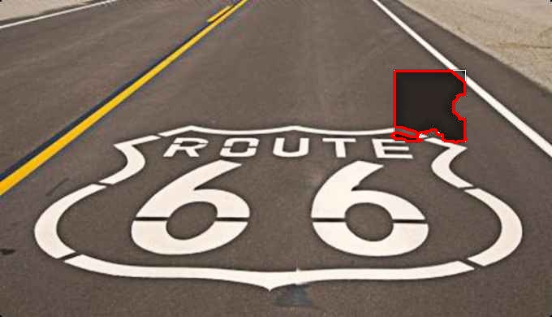

# Slider-captcha-recognition-tool
基于py的识别简单滑动验证码的程序
# 👽宇宙安全声明：
* 代码仅供交流学习，使用此代码请后果自负
# ⚡️快速上手：
* 1.克隆或下载此存储库，推荐使用以下命令：
   ```
   git clone https://github.com/MrBZBZ/Slider-captcha-recognition-tool.git
   ```
* 2.设置 Python 环境：确保您具有版本 3.9 或更高版本的 Python 环境。
* 3.在PyCharm打开刚刚下载的存储库
* 4.安装依赖：你需要的库有cv2，numpy
* 5.直接打开main.py
* 6.在更改你想要识别的验证码的图片为路径后运行，即可输出一个识别的结果图片和验证码缺口最左边的X坐标
# 关于代码
放出源码供大家交流学习，不做release了（也没啥好做的，你复制代码就能用了）
# 实战效果
正确率还是可以的，因为是基于opencv的轮廓检测和阴影检测识别，所以识别缺口底色是阴影的效果比较好，但是像网易易盾那样的就不行了
如果可以的话帮我想想还可以如何改进算法吧
## 成功案例
这些验证码的干扰度都比较小所以比较好识别



## 失败案例
这些验证码都包含有一定面积的阴影，而且他们的缺口并不是全覆盖住阴影的因此程序检测不出来

我暂时还没有办法去解决


